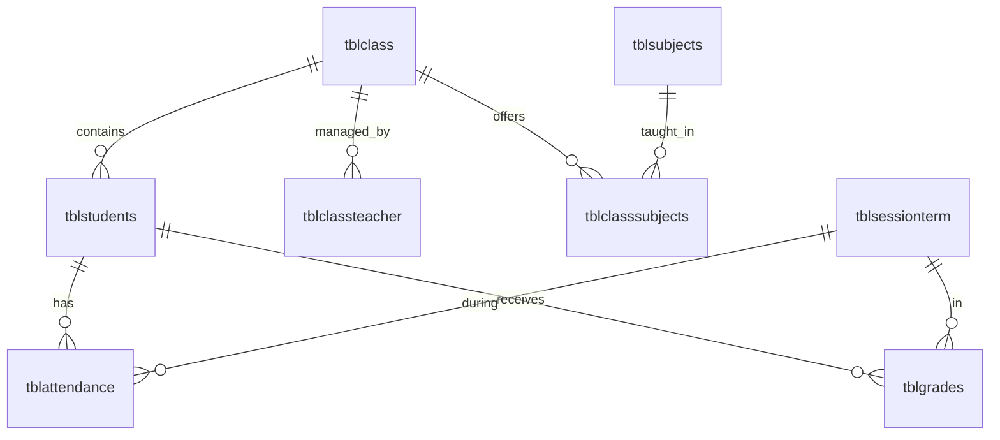

# 🎓 Hệ Thống Quản Lý Điểm Danh Sinh Viên

[](https://php.net/)
[](https://www.mysql.com/)
[](https://getbootstrap.com/)
[](https://www.apachefriends.org/)

> **Hệ thống quản lý điểm danh sinh viên hiện đại, đa chức năng với giao diện tiếng Việt thân thiện**

## 📋 Mục Lục

- [✨ Tính Năng](#-tính-năng)
- [🚀 Cài Đặt](#-cài-đặt)
- [🏗️ Cấu Trúc Dự Án](#️-cấu-trúc-dự-án)
- [💾 Cơ Sở Dữ Liệu](#-cơ-sở-dữ-liệu)
- [👥 Phân Quyền Người Dùng](#-phân-quyền-người-dùng)
- [🛠️ Công Nghệ Sử Dụng](#️-công-nghệ-sử-dụng)
- [📱 Giao Diện](#-giao-diện)
- [🔧 Tính Năng Nâng Cao](#-tính-năng-nâng-cao)
- [📊 Báo Cáo & Thống Kê](#-báo-cáo--thống-kê)
- [🔄 Cập Nhật Gần Đây](#-cập-nhật-gần-đây)
- [🤝 Đóng Góp](#-đóng-góp)
- [📄 Giấy Phép](#-giấy-phép)

## ✨ Tính Năng

### 🎯 **Quản Lý Cốt Lõi**
- ✅ **Quản lý lớp học** - Tạo, chỉnh sửa, xóa lớp học
- ✅ **Quản lý sinh viên** - CRUD sinh viên với thông tin đầy đủ
- ✅ **Quản lý giáo viên** - Phân công giáo viên chủ nhiệm lớp
- ✅ **Quản lý năm học & học kỳ** - Thiết lập thời gian học tập

### 📚 **Quản Lý Môn Học & Điểm Số**
- ✅ **Quản lý môn học** - Thêm, sửa, xóa môn học
- ✅ **Phân công môn học** - Gán môn học cho từng lớp
- ✅ **Nhập điểm sinh viên** - Hệ thống tính điểm tự động
- ✅ **Xem bảng điểm** - Thống kê điểm số chi tiết

### 📅 **Hệ Thống Điểm Danh**
- ✅ **Điểm danh thời gian thực** - Giao diện AJAX hiện đại
- ✅ **Lịch sử điểm danh** - Theo dõi từng buổi học
- ✅ **Báo cáo điểm danh** - Xuất Excel/PDF
- ✅ **Thống kê tỷ lệ** - Phân tích hiệu suất học tập

### 🔐 **Bảo Mật & Phân Quyền**
- ✅ **3 cấp độ người dùng** - Admin, Giáo viên, Sinh viên
- ✅ **Xác thực an toàn** - Session management
- ✅ **Phân quyền chi tiết** - Mỗi role có chức năng riêng

## 🚀 Cài Đặt

### **Yêu Cầu Hệ Thống**
- PHP 7.4 trở lên
- MySQL 8.0 trở lên
- XAMPP 8.2+ (khuyến nghị)
- Trình duyệt web hiện đại

### **Bước 1: Clone Repository**
```bash
git clone https://github.com/yourusername/Student-Attendance-System.git
cd Student-Attendance-System
```

### **Bước 2: Cài Đặt XAMPP**
1. Tải và cài đặt [XAMPP](https://www.apachefriends.org/)
2. Khởi động Apache và MySQL
3. Copy project vào thư mục `htdocs`

### **Bước 3: Cài Đặt Database**
1. Mở phpMyAdmin: `http://localhost/phpmyadmin`
2. Tạo database mới: `qlsinhvien2`
3. Import file `database_updates.sql`

### **Bước 4: Cấu Hình Kết Nối**
Chỉnh sửa file `Includes/dbcon.php`:
```php
$username = "root";
$password = "";
$db = "qlsinhvien2";
```

### **Bước 5: Truy Cập Hệ Thống**
- **URL chính**: `http://localhost/Student-Attendance-System/`
- **Tài khoản mặc định**: Xem file `database_updates.sql`

## 🏗️ Cấu Trúc Dự Án

```
Student-Attendance-System/
├── 📁 Admin/                 # Giao diện quản trị viên
│   ├── 📄 index.php         # Dashboard chính
│   ├── 📄 createClass.php   # Quản lý lớp học
│   ├── 📄 createStudents.php # Quản lý sinh viên
│   ├── 📄 createClassTeacher.php # Quản lý giáo viên
│   ├── 📄 manageSubjects.php # Quản lý môn học
│   └── 📁 Includes/         # Header, sidebar, footer
├── 📁 ClassTeacher/         # Giao diện giáo viên
│   ├── 📄 index.php         # Dashboard giáo viên
│   ├── 📄 takeAttendance.php # Điểm danh sinh viên
│   ├── 📄 viewStudents.php  # Xem danh sách sinh viên
│   ├── 📄 manageGrades.php  # Quản lý điểm số
│   └── 📁 Includes/         # Header, sidebar, footer
├── 📁 Student/              # Giao diện sinh viên
│   ├── 📄 index.php         # Dashboard sinh viên
│   ├── 📄 viewProfile.php   # Thông tin cá nhân
│   ├── 📄 viewMyGrades.php  # Xem điểm số
│   └── 📁 Includes/         # Header, sidebar, footer
├── 📁 Includes/             # Kết nối database, session
├── 📁 vendor/               # Thư viện Bootstrap, FontAwesome
├── 📄 index.php             # Trang đăng nhập chính
├── 📄 database_updates.sql  # Cấu trúc database
└── 📄 README.md             # Tài liệu này
```

## 💾 Cơ Sở Dữ Liệu

### **Bảng Chính**
| Bảng | Mô Tả |
|------|-------|
| `tblclass` | Thông tin lớp học |
| `tblstudents` | Thông tin sinh viên |
| `tblclassteacher` | Phân công giáo viên chủ nhiệm |
| `tblsubjects` | Danh sách môn học |
| `tblclasssubjects` | Phân công môn học cho lớp |
| `tblattendance` | Dữ liệu điểm danh |
| `tblgrades` | Điểm số sinh viên |
| `tblsessionterm` | Năm học và học kỳ |

### **Quan Hệ Database**


## 👥 Phân Quyền Người Dùng

### **🔴 Administrator**
- Quản lý toàn bộ hệ thống
- Tạo/xóa lớp học, sinh viên, giáo viên
- Quản lý môn học và phân công
- Xem báo cáo tổng hợp
- Quản lý năm học và học kỳ

### **🟡 Class Teacher (Giáo Viên)**
- Điểm danh sinh viên trong lớp
- Xem danh sách sinh viên
- Nhập và quản lý điểm số
- Xuất báo cáo điểm danh
- Xem thống kê lớp

### **🟢 Student (Sinh Viên)**
- Xem thông tin cá nhân
- Xem lịch sử điểm danh
- Xem điểm số các môn học
- Xem báo cáo học tập
- Theo dõi tiến độ học tập

## 🛠️ Công Nghệ Sử Dụng

### **Backend**
- **PHP 7.4+** - Ngôn ngữ lập trình chính
- **MySQL 8.0+** - Hệ quản trị cơ sở dữ liệu
- **Session Management** - Quản lý phiên đăng nhập
- **AJAX** - Tương tác không đồng bộ

### **Frontend**
- **Bootstrap 5.3+** - Framework CSS responsive
- **FontAwesome 6** - Icon library
- **jQuery** - JavaScript library
- **HTML5 & CSS3** - Markup và styling

### **Development Tools**
- **XAMPP** - Local development environment
- **phpMyAdmin** - Database management
- **VS Code** - Code editor (khuyến nghị)

## 📱 Giao Diện

### **🎨 Thiết Kế Responsive**
- Giao diện thích ứng mọi thiết bị
- Mobile-first approach
- Bootstrap grid system
- Modern UI/UX design

### **🌐 Đa Ngôn Ngữ**
- **Tiếng Việt** - Ngôn ngữ chính
- Giao diện thân thiện người Việt
- Thuật ngữ giáo dục chuẩn

### **🎯 Dashboard Tương Tác**
- Cards thống kê trực quan
- Charts và biểu đồ
- Navigation sidebar
- Breadcrumb navigation

## 🔧 Tính Năng Nâng Cao

### **📊 Hệ Thống Điểm Số**
- **Tính điểm tự động**: Assignment + Midterm + Final
- **Xếp loại**: A, B, C, D, F
- **Thống kê lớp**: Điểm trung bình, cao nhất, thấp nhất
- **Xuất báo cáo**: Excel format

### **📅 Quản Lý Điểm Danh**
- **AJAX real-time**: Cập nhật không reload trang
- **Lọc theo ngày**: Chọn ngày cụ thể
- **Lọc theo học kỳ**: Năm học và học kỳ
- **Trạng thái**: Có mặt/Vắng với badge màu

### **🔍 Tìm Kiếm & Lọc**
- **Search real-time**: Tìm kiếm sinh viên
- **Filter đa tiêu chí**: Lớp, môn học, thời gian
- **Pagination**: Phân trang dữ liệu
- **Sorting**: Sắp xếp theo cột

## 📊 Báo Cáo & Thống Kê

### **📈 Dashboard Analytics**
- Tổng số sinh viên, giáo viên, lớp học
- Thống kê điểm danh theo ngày
- Biểu đồ xu hướng học tập
- Top sinh viên xuất sắc

### **📋 Báo Cáo Chi Tiết**
- **Báo cáo điểm danh**: Excel/PDF export
- **Báo cáo điểm số**: Theo lớp, môn học
- **Thống kê học tập**: Tỷ lệ đạt, trung bình
- **Báo cáo định kỳ**: Tuần, tháng, học kỳ

## 🔄 Cập Nhật Gần Đây

### **v2.0.0 - Major Update**
- ✅ Loại bỏ hệ thống "phân lớp" (class arms)
- ✅ Đơn giản hóa cấu trúc database
- ✅ Thêm quản lý môn học và điểm số
- ✅ Cải thiện giao diện điểm danh AJAX
- ✅ Thêm trang thông tin sinh viên

### **v1.5.0 - Feature Update**
- ✅ Thêm module sinh viên đăng nhập
- ✅ Cải thiện bảo mật session
- ✅ Thêm xuất báo cáo Excel
- ✅ Giao diện tiếng Việt hoàn chỉnh

### **v1.0.0 - Initial Release**
- ✅ Hệ thống điểm danh cơ bản
- ✅ Quản lý lớp học và sinh viên
- ✅ Phân quyền 3 cấp độ
- ✅ Giao diện Bootstrap responsive

## 🤝 Đóng Góp

Chúng tôi rất hoan nghênh mọi đóng góp! Hãy tham gia phát triển:

### **📝 Cách Đóng Góp**
1. **Fork** repository này
2. Tạo **feature branch**: `git checkout -b feature/AmazingFeature`
3. **Commit** thay đổi: `git commit -m 'Add some AmazingFeature'`
4. **Push** lên branch: `git push origin feature/AmazingFeature`
5. Tạo **Pull Request**

### **🐛 Báo Cáo Lỗi**
- Sử dụng [GitHub Issues](https://github.com/yourusername/Student-Attendance-System/issues)
- Mô tả chi tiết vấn đề gặp phải
- Đính kèm screenshot nếu có thể
- Ghi rõ phiên bản và môi trường

### **💡 Đề Xuất Tính Năng**
- Tạo issue với label `enhancement`
- Mô tả chi tiết tính năng mong muốn
- Giải thích lý do cần thiết
- Đề xuất cách triển khai

## 📄 Giấy Phép

Dự án này được phân phối dưới giấy phép **MIT**. Xem file `LICENSE` để biết thêm chi tiết.

---

## 📞 Liên Hệ

- **Tác giả**: Nguyễn Thanh Huy
- **Email**: Thanhhuypm77@gmail.com
- **GitHub**: https://github.com/thanhhuyIT77

## ⭐ Đánh Giá

Nếu dự án này hữu ích, hãy cho chúng tôi một ⭐ trên GitHub!

---

<div align="center">

**Made with ❤️ for Vietnamese Education**

</div>
